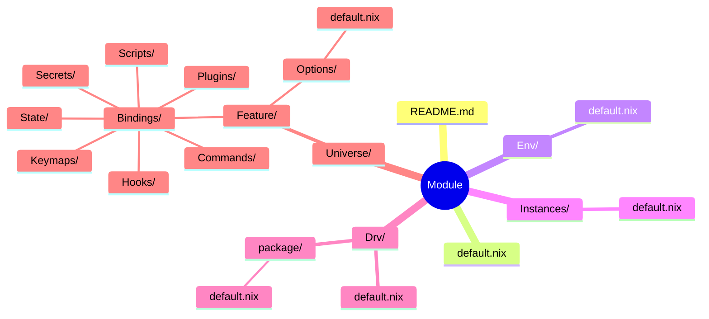

# Universes

Dendritic Nix configuration system.

**Pattern Version: v1.0.5** | **Structure: FROZEN**

---

## Overview

| Aspect | Description |
|--------|-------------|
| Pattern | Dendritic Nix (flake-parts + import-tree) |
| Philosophy | Capability-centric, not tool-centric |
| Structure | Two-level adjunction (Global ⊣ Local) |
| Language | Agnostic (Nix, Python, Rust, etc.) |

**Core Principles:**
- Index on CAPABILITY, not IMPLEMENTATION
- Minimize the generating set: prefer tools spanning multiple capabilities
- New dependency rule: add a tool IF AND ONLY IF no existing tool covers the capability
- TUI = justfile + gum (no additional frameworks needed)

---

## Execution Stack

```
Nix (types + packaging) → Nushell (glue + interop) → CLIs (effects)
```

| Layer | Role | Artifact |
|-------|------|----------|
| Nix Options | Type declarations, single source of truth | `Options/default.nix` |
| Nix Drv | Freeze language-specific logic into CLI | `Drv/<pkg>/default.nix` |
| Nushell Scripts | Glue layer, typed off Options, calls CLIs | `Bindings/Scripts/default.nu` |
| CLIs | Effectful programs (Python, Rust, etc.) | `rl train`, `audio-process`, etc. |

**Key principles:**
- Nix module Options = single source of truth for ALL typing
- Nushell scripts are typed off Nix module Options (config shape = Options type)
- All language-specific logic frozen into Nix derivations with CLI interface
- Nushell orchestrates CLIs — never calls language APIs directly
- Arch.d2 = morphism diagram: trace any capability from type → term → effect
- Implementation is mechanical from a correct Arch.d2

**The morphism chain:**
```
Options (types) → ENV vars (config) → Nushell (glue) → CLI (effects) → Data (state)
```

Every Arch.d2 should read as a commutative diagram — trace any capability from its type declaration through its binding to its effect and verify it commutes.

### Toolchain

Each layer in the stack has a minimal, purpose-fit tool:

| Tool | Layer | Role |
|------|-------|------|
| Nix Options | Types | Declare capability space, single source of truth |
| uv | Packaging | Install Python deps into venv inside Nix derivation — fast, reliable, no nixpkgs breakage |
| makeWrapper | CLI | Wrap a Python/Rust/etc binary with correct PATH/PYTHONPATH — produces a clean CLI entry point |
| Nushell | Glue | Typed pipeline scripting — orchestrate CLIs, parse config, structured data flow |
| justfile | Interface | Self-documenting recipes — thin wrapper over nushell scripts, the user-facing API |
| gum | Formatting | Styled terminal output (borders, colors, prompts) — no TUI framework needed |

**Python packaging pattern (Drv/):**
```nix
# Use uv to install deps, makeWrapper to produce CLI
buildPhase = ''
  uv venv $out/venv --python ${python}/bin/python
  uv pip install --python $out/venv/bin/python <deps>
'';
installPhase = ''
  makeWrapper $out/venv/bin/python $out/bin/<cli-name> \
    --add-flags "$out/lib/main.py"
'';
```

This avoids fighting nixpkgs' broken/missing Python packages (e.g. ale-py on aarch64-darwin). uv resolves and installs from PyPI directly inside the Nix sandbox. The result is a hermetic derivation with a clean CLI.

**Why not buildPythonApplication with nixpkgs deps?**
Transitive dependency hell. A single unsupported platform in a deep transitive dep (e.g. `gymnasium → ale-py → aarch64-darwin`) blocks the entire build. uv sidesteps this entirely — it installs wheels from PyPI, handles platform-specific resolution, and is fast.

---

## Core Dualities

The pattern is built on two adjoint pairs:

### Global Duality (Module-level)

| Env | ⊣ | Instances |
|-----|---|-----------|
| Aggregates Options → ENV vars | | Consumes Env → Nix targets |
| Left adjoint (free) | | Right adjoint (forgetful) |

### Local Duality (Universe-level)

| Options | ⊣ | Bindings |
|---------|---|----------|
| Schema, types, constraints | | Runtime behavior, effects |
| Typeclass (interface) | | Instance (implementation) |

### Options ⊣ Bindings: The Free-Forgetful Adjunction

**CRITICAL**: Options and Bindings must remain decoupled.

| Options (Free/Abstract) | Bindings (Forgetful/Concrete) |
|-------------------------|-------------------------------|
| Vendor-agnostic | Vendor-specific |
| Capability-centric | Implementation-centric |
| "What I want" | "How to get it" |
| `trackingUri` | `MLFLOW_TRACKING_URI` or `WANDB_BASE_URL` |
| `experimentName` | `MLFLOW_EXPERIMENT_NAME` or `WANDB_PROJECT` |

**Anti-pattern** (coupled):
```nix
options.store.mlflow.trackingUri = ...;  # ❌ Vendor in Options
options.store.wandb.project = ...;       # ❌ Vendor in Options
```

**Correct pattern** (decoupled):
```nix
# Options - abstract capability
options.store.trackingUri = ...;      # ✓ Generic
options.store.experimentName = ...;   # ✓ Generic
options.store.backend = enum [ "mlflow" "wandb" "local" ];

# Bindings - concrete mapping per backend
if backend == "mlflow" then MLFLOW_TRACKING_URI = trackingUri
if backend == "wandb" then WANDB_BASE_URL = trackingUri
```

### Options Design Decision Tree

```
Is this field specific to ONE implementation/vendor?
  YES → Does NOT belong in Options, handle in Bindings
  NO ↓

Is this a universal capability concept?
  YES → Add to Options with generic name
  NO ↓

Is it a configuration knob users would want to set?
  YES → Add to Options
  NO → Hardcode in Bindings or derive from other Options
```

---

## Instance Architecture

**FROZEN DECISION (v1.0.4)**: Platform-agnostic deployment, hardware-specific systems.

### The Two Instance Types

| Instance | Scope | Contains | Platform |
|----------|-------|----------|----------|
| `homeConfigurations` | User-space | shell, editor, dev tools | ALL (Darwin, NixOS, WSL) |
| `nixosConfigurations` | System | boot, kernel, filesystems, servers | NixOS or OCI |

### Deployment Formats

nixosConfigurations can be deployed in multiple formats:

| Format | Use Case | Command |
|--------|----------|---------|
| `iso` | Bootable USB | `just flash <machine> /dev/diskN` |
| `vm` | Local testing | `just vm <machine>` |
| `sd-image` | Raspberry Pi | `just build <machine>` |
| `raw-efi` | Direct disk | `just build <machine>` |
| `oci` | Container (anywhere) | `just remote-build-oci <host> <machine>` |
| `microvm` | Fast cloud testing | `just remote-microvm <host> <machine>` |

### OCI = Platform Agnostic

For running NixOS configurations on Darwin:

```bash
# Build on Linux (remote)
just remote-build-oci cloud-dev sovereignty

# Load and run on Darwin
just load-oci sovereignty
just run-oci sovereignty
```

### Servers are Capabilities

Servers/ defines capabilities (objectStore, git, etc.) consumed by Machines:

```nix
machines.sovereignty = {
  identity.hostname = "sovereignty";
  target.arch = "x86_64";
  persistence.strategy = "impermanent";
  users = [
    { name = "root"; }
    { name = "zoshodi"; }
  ];
};
```

Each user's homeConfiguration is imported, bringing their servers with them.

### Deployment

```bash
# Darwin (portable)
home-manager switch --flake .#darwin

# NixOS (hardware + users)
nixos-rebuild switch --flake .#sovereignty
```

---

## Categorical Organization

**Symmetry basis: Maximum deployment scope.**

Every module is classified by the highest level of the system hierarchy it can coherently target. This is mechanically checkable by inspecting `Instances/default.nix`.

```
Modules/
├── Labs/     # perSystem — build-time artifacts, devShells, experiments
├── User/     # homeManager — user-space, platform-agnostic
├── Host/     # nixos/darwin — OS-level, system configuration
└── Fleet/    # *Configurations — top-level instantiators
```

### Scope Hierarchy

```
perSystem (build-time only, no deployment state)
  ⊂ homeManager (user-space, any platform)
    ⊂ nixos/darwin (system-level, specific OS)
      ⊂ *Configurations (full instantiation = system + users + hardware)
```

Each level strictly contains the ones below it — a `nixosConfiguration` imports `homeManager` modules, which can use `perSystem` packages.

### Category Boundaries

| Category | Scope | Essence | Target |
|----------|-------|---------|--------|
| **Labs** | perSystem | Build-time workspaces, experiments, tooling | devShells, packages, checks |
| **User** | homeManager | User environment, preferences, tools | flake.modules.homeManager.* |
| **Host** | nixos/darwin | System-level daemons, OS config, containers | flake.modules.{nixos,darwin}.* |
| **Fleet** | *Configurations | Instantiators that yield deployable artifacts | flake.{home,nixos}Configurations |

### Category Decision Tree

```
Look at Instances/default.nix:

Exports flake.*Configurations?            → Fleet/
Exports flake.modules.{nixos,darwin}.*?   → Host/
Exports flake.modules.homeManager.* ONLY? → User/
Exports perSystem.* ONLY?                 → Labs/
```

### Quick Reference

| Thing | Category | Why |
|-------|----------|-----|
| Audio workstation, RL training | Labs | perSystem devShells/packages |
| Checks, deploy scripts | Labs | perSystem checks/packages |
| Neovim, shells, browsers | User | homeManager user preferences |
| Git config, SSH | User | homeManager user-space |
| Nix daemon, secrets | Host | Requires nixos/darwin system access |
| Servers (podman containers) | Host | Requires nixos systemd |
| Home (homeConfigurations) | Fleet | Instantiates top-level output |
| Machines (nixosConfigurations) | Fleet | Instantiates top-level output |

---

## Module Structure



Every module follows this frozen structure:

```
<Module>/
├── README.md           # Documentation (this template)
├── default.nix         # Tensor (empty, import-tree entry)
├── Env/                # Global: ENV var aggregation
├── Instances/          # Global: flake.modules.* exports
├── Drv/                # Optional: custom derivations
│   └── <package>/      # One subdir per package
│       └── default.nix # buildPythonPackage, mkDerivation, etc.
└── Universe/           # Local: feature microcosm
    └── <Feature>/
        ├── Options/    # Schema (default.nix ≅ index.<lang>)
        └── Bindings/   # Effects (Scripts, Commands, Keymaps, Hooks, State, Secrets, Plugins)
```

### Drv/ Structure

For custom derivations (when nixpkgs is broken/outdated):

```
Drv/
├── default.nix         # Empty tensor (import-tree entry)
├── mlflow/
│   └── default.nix     # buildPythonPackage { pname = "mlflow"; ... }
├── sb3/
│   └── default.nix     # buildPythonPackage { pname = "stable-baselines3"; ... }
└── <package>/
    └── default.nix
```

Each `Drv/<package>/default.nix` exports to `perSystem.packages.<package>`.

### Hierarchy

| Level | Location | Has | Example |
|-------|----------|-----|---------|
| Category | `Modules/<Cat>/` | `default.nix` only | `Labs/`, `User/` |
| Module | `Modules/<Cat>/<Mod>/` | README.md, Arch.d2, Env/, Instances/, Universe/ | `Browsers/`, `Terminal/Shell/` |
| Feature | `Universe/<Feat>/` | Options/, Bindings/ | `Universe/Firefox/`, `Universe/Config/` |

Categories are organizational containers. Modules are capability units with full structure. Features are local sub-modules within a Module's Universe/.

---

## Invariants

```
1. Every .nix file is a flake-parts module
2. Every Module has: README.md, default.nix, Env/, Instances/, Universe/
3. Every Universe/<Feature> has: Options/, Bindings/
4. Universe/<Feature> = sub-object classifier of the capability space
5. Options = type (possibility space), Bindings = terms (inhabitants)
6. Bindings/ ⊆ {Scripts, Commands, Keymaps, Hooks, State, Secrets, Plugins}
7. Env/ aggregates Universe/*/Options → ENV vars
8. Instances/ consumes config generically (no manual enumeration)
9. NO manual imports (import-tree auto-imports)
10. File naming: default.* only
11. Standard scripting: Nushell ONLY (default.nu) - NO bash, NO sh, NO zsh
12. Modules enable themselves: if created, capability is desired
13. Options/default.nix is single source of truth for all schema
14. Scripts are interpreters of Options, not imperative commands
15. NO hidden CLI params - all configuration explicit in Options
16. Justfile recipes use `#!/usr/bin/env nu` shebang when multi-line
17. All nushell scripts strongly typed - explicit annotations, no implicit conversions
18. Every module requires README.md + Arch.d2 (architecture diagram)
19. Naming is semantic binding to capability - optimize for best fit
20. CLI output uses gum styling, external tools run silent (-q, -loglevel error)
21. Justfile is self-documenting: recipes match 1-1 with README capabilities
22. Containers are portable: Servers/ exports to BOTH homeManager and nixos
23. nixosConfigurations is for hardware/system only, imports homeConfigurations for users
24. Deployment target = hardware; Capability = containers (platform-agnostic)
25. Nushell scripts typed off Nix module Options — config shape = Options type
26. Language-specific logic frozen in Drv/ with CLI interface — nushell calls CLIs only
27. Arch.d2 is the morphism diagram — implementation is mechanical from it
28. NO string interpolation in nushell — use typed variables, `print` with arguments, structured data. Prefer `[$a $b] | str join " "` over `$"($a) ($b)"`. Strong typing over string templating.
```

---

## Nushell Type Discipline

Nushell is the glue layer in the execution stack. All nushell code MUST follow these typing rules to maintain the morphism chain from Nix Options through to CLI effects.

### Principle: Strong Typing Over String Templating

Nushell has a structural type system with `record<>`, `list<>`, `table<>`, typed function signatures (`def foo []: input -> output`), and `match` for dispatch. Use it. String interpolation (`$"..."`) bypasses the type system entirely — it is untyped string templating that produces opaque strings from typed values. This is the exact opposite of what we want.

### The Rules

```
1. Every `let` binding MUST have an explicit type annotation
2. Every `def` parameter MUST have a type annotation
3. Every `def` MUST declare input/output types via `[]: input -> output`
4. Use `str join` for string assembly — never `$"..."`
5. Use `| into int`, `| into string` for explicit type conversions
6. Use `match` for dispatch over values — never if/else chains on strings
7. Use `record<>` and `list<>` compound types where structure is known
8. Data flows through typed pipelines — not through string formatting
```

### Type Signature Reference

```nu
# Variable declarations — always annotate
let x: int = 9
let name: string = "hello"
let items: list<string> = ["a" "b" "c"]
let cfg: record<name: string, count: int> = {name: "foo", count: 3}

# Function signatures — annotate params AND input/output
def process [path: string, n: int]: nothing -> list<string> {
  open $path | lines | first $n
}

# Multiple input/output type pairs
def transform []: [
  string -> list<string>
  list<string> -> table
] { }

# Closures — annotate parameters
do {|nums: list<int>| $nums | math sum } [1 2 3]
```

### String Assembly (CORRECT)

```nu
# str join with typed values — not string interpolation
let count: int = 42
let dir: string = "/tmp"
print ["Found" ($count | into string) "items in" $dir] | str join " "

# Multi-part output: build list, join, print
let parts: list<string> = [
  "  total:" ($total | into string)
  "validated:" ($validated | into string)
  "best:" $best_str
]
$parts | str join " " | print
```

### Record Pattern for Status/Config

```nu
# Build typed records, print fields — not interpolated strings
let status: record = {
  env: ($env.RL_ENV_ID? | default "stocks-v0")
  algo: ($env.RL_AGENT_ALGORITHM? | default "ppo")
  provider: ($env.RL_DATA_PROVIDER? | default "csv")
}
print ["  Env:" $status.env] | str join " "
print ["  Agent:" $status.algo] | str join " "
```

### Match for Dispatch

```nu
# WRONG: if/else chain on strings
if $provider == "csv" { ... } else if $provider == "yahoo" { ... }

# CORRECT: match (exhaustive pattern matching)
match $provider {
  "csv" => { open $file }
  "yahoo" => { ^rl data download --provider yahoo }
  "alpaca" => { ^rl data download --provider alpaca }
  _ => { error make {msg: "unknown provider"} }
}
```

---

## Language Agnosticism

Options can be defined in any language:

| Language | File | Manifest |
|----------|------|----------|
| Nix | `default.nix` | — |
| Python | `index.py` | `pyproject.toml` |
| Rust | `index.rs` | `Cargo.toml` |
| TypeScript | `index.ts` | `package.json` |

The isomorphism:
```
Options/default.nix ≅ Options/index.<lang> ≅ ENV vars ≅ CLI flags
```

---

## Targets

| Target | Scope | Purpose |
|--------|-------|---------|
| `flake.modules.homeManager.*` | User | Home-manager modules |
| `flake.modules.nixos.*` | System | NixOS modules |
| `flake.modules.darwin.*` | System | nix-darwin modules |
| `perSystem.devShells.*` | Dev | Development environments |
| `perSystem.packages.*` | Build | Derivations |
| `perSystem.checks.*` | CI | Validation |

---

## Bindings Categories

| Category | Signature | Purpose |
|----------|-----------|---------|
| Scripts | `() → Effect` | Entry points (default.nu) |
| Commands | `Cmd → Effect` | CLI commands |
| Keymaps | `Key → Action` | Input bindings |
| Hooks | `Event → Effect` | Lifecycle (Init, Save, Load, Log, Sync, Cleanup) |
| State | `S → S` | State machines |
| Secrets | `Path → Value` | Sensitive data |
| Plugins | `Base → Extended` | Extensions |

---

## Modules

### Labs

| Module | Purpose | Targets |
|--------|---------|---------|
| [Audio](Modules/Labs/Audio/) | Signal processing workstation | devShells, packages |
| [RL](Modules/Labs/RL/) | Reinforcement learning | devShells, packages |
| [Game](Modules/Labs/Game/) | Game development | devShells, packages |
| [Checks](Modules/Labs/Checks/) | Linting, invariants | devShells, checks |
| [Deploy](Modules/Labs/Deploy/) | Deployment scripts | packages |
| [Scripts](Modules/Labs/Scripts/) | Justfile tooling | packages |
| [Legal](Modules/Labs/Legal/) | Legal compliance reference | devShells, checks |
| [Sovereignty](Modules/Labs/Sovereignty/) | Off-grid capability planning | devShells |

### User

| Module | Purpose | Targets |
|--------|---------|---------|
| [Browsers](Modules/User/Browsers/) | Web browsing | homeManager |
| [Editor](Modules/User/Editor/) | Text editing (Nixvim) | homeManager |
| [Terminal](Modules/User/Terminal/) | Shell, Tmux, Kitty | homeManager |
| [Network](Modules/User/Network/) | SSH, connectivity | homeManager |
| [Git](Modules/User/Git/) | Version control config | homeManager |

### Host

| Module | Purpose | Targets |
|--------|---------|---------|
| [Boot](Modules/Host/Boot/) | Boot loader, kernel | nixos |
| [Network](Modules/Host/Network/) | System networking, firewall, SSH daemon | nixos |
| [Display](Modules/Host/Display/) | Graphical environment (opt-in) | nixos |
| [Nix](Modules/Host/Nix/) | Nix daemon, store optimization | nixos, darwin, homeManager |
| [Secrets](Modules/Host/Secrets/) | Encrypted secrets (sops-nix) | nixos, homeManager |
| [Servers](Modules/Host/Servers/) | Self-hosted containers | nixos |

### Fleet

| Module | Purpose | Targets |
|--------|---------|---------|
| [Home](Modules/Fleet/Home/) | homeConfigurations aggregator | homeConfigurations |
| [Machines](Modules/Fleet/Machines/) | nixosConfigurations aggregator | nixosConfigurations |

---

## Wrapping External Packages

### Decision Tree

```
Does the repo have a flake.nix?
  YES → Add to inputs, use outputs directly
  NO ↓

Is it in nixpkgs?
  YES → Use pkgs.<name>
  NO ↓

Fetch and build derivation:
  fetchFromGitHub + mkDerivation/buildPythonPackage/etc.
```

### Module Wrapping Philosophy

**CRITICAL**: Once wrapped as a Nix module, you NEVER enter shells or manage packages manually.

```
Traditional (❌)                    Module-Wrapped (✓)
─────────────────                   ──────────────────
nix develop .#env                   rl-train
pip install package                 rl-eval
python script.py                    rl-infer --load-best
source venv/bin/activate            introspect-options rl
```

The module exports CLI commands globally. No shells, no per-system package management, no breakage.

### Wrapping Strategy

```
1. Discover   → <tool> --help, env | grep TOOL_, cat ~/.config/tool/*
2. Map        → CLI flags / ENV vars / config files → Options (vendor-agnostic)
3. Wire       → Options → ENV vars in Bindings (vendor-specific)
4. Export     → Instances → perSystem.packages.<cmd> (global CLI)
```

Example:

```nix
# Universe/Core/Options/default.nix
options.coolTool = {
  enable = lib.mkEnableOption "cool-tool";
  port = lib.mkOption { type = lib.types.port; default = 8080; };
  logLevel = lib.mkOption { type = lib.types.enum ["debug" "info" "warn"]; default = "info"; };
};

# Instances/default.nix  
config.perSystem = { pkgs, ... }: lib.mkIf cfg.enable {
  packages.cool-tool = pkgs.writeShellScriptBin "cool-tool" ''
    export COOL_TOOL_PORT="${toString cfg.port}"
    export COOL_TOOL_LOG_LEVEL="${cfg.logLevel}"
    exec ${pkgs.cool-tool}/bin/cool-tool "$@"
  '';
};
```

Users interact via: `cool-tool --some-flag` (globally available, no shell needed).

### Introspection

Prevent type mismatches by introspecting module options:

```bash
introspect-options Modules/Labs/RL

# Output:
# Features in Modules/Labs/RL/Universe/
# 
# Env
#     envId
#     nEnvs
#     seed
# Agent
#     algorithm
#     policyType
#     netArch
```

This parses `Universe/*/Options/default.nix` files to show the exact option space.

### Configuration Surface Isomorphism

All configuration mechanisms are equivalent:

```
CLI flags    ≅  ENV vars      ≅  Config files    ≅  Options/default.nix
--port=8080  ≅  PORT=8080     ≅  port: 8080      ≅  port = 8080;
--verbose    ≅  VERBOSE=true  ≅  verbose: true   ≅  verbose = true;
```

Pick whichever the tool supports best, wire in Instances.

---

## Usage

```bash
# Check all invariants
nix flake check

# Build darwin home configuration
nix build .#homeConfigurations.darwin.activationPackage

# Switch to configuration
home-manager switch --flake .#darwin

# Enter dev shell
nix develop .#checks
```

---

## Flake Integration

```nix
{
  inputs = {
    nixpkgs.url = "github:NixOS/nixpkgs/nixos-unstable";
    flake-parts.url = "github:hercules-ci/flake-parts";
    import-tree.url = "github:vic/import-tree";
  };

  outputs = inputs: inputs.flake-parts.lib.mkFlake { inherit inputs; } 
    (inputs.import-tree ./Modules);
}
```

---

## Changelog

| Version | Date | Changes |
|---------|------|---------|
| v1.0.5 | 2026-02-06 | Scope-based categories (Labs/User/Host/Fleet), dissolve Computation/Information/Physical |
| v1.0.4 | 2026-02-05 | Platform-agnostic containers, invariants 22-24 |
| v1.0.3 | 2026-01-27 | README.md required, Nushell standard, file naming |
| v1.0.2 | 2026-01-27 | Plugins in Bindings/, 7 binding types |
| v1.0.1 | 2026-01-27 | default.nix naming |
| v1.0.0 | 2026-01-27 | Frozen structure, two-level adjunction |

---

## Notes

Common pitfalls and lessons learned:

| Issue | Solution |
|-------|----------|
| Nix float literals like `3e-4` fail | Use `lib.types.str` with `"3e-4"`, parse in binding |
| Cross-platform checks fail on wrong system | Use `--system` flag or filter hosts by `system` |
| Module not exported to `flake.modules.*` | Ensure `<module>.enable = true` in Bindings |
| Infinite recursion with `mkIf cfg.enable` | Don't set `x.enable` inside `mkIf x.enable` block |
| Where to set `<module>.enable = true` | Global: `Instances/`, Local features: `Universe/<Feature>/Bindings/` |
| Package not building | Always `nix search nixpkgs <pkg>` or `nix eval nixpkgs#<pkg>.pname` first |
| Python ML packages (tf, mlflow, sb3) | Create custom derivation in `Drv/` rather than fight nixpkgs versions |
| Shell headaches | Don't use shells - wrap everything as CLI commands in `Instances/` |
| Type mismatches during implementation | Use `introspect-options <module-path>` to see exact option space |

---

**Pattern Version: v1.0.5** | **Structure: FROZEN** | **Expressiveness: Universe/** | **Interaction: CLI only**
