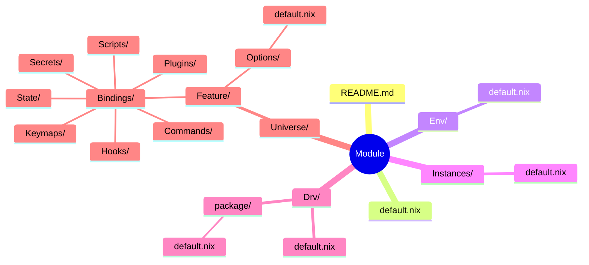

# Universes

Dendritic Nix configuration system.

**Pattern Version: v1.0.3** | **Structure: FROZEN**

---

## Overview

| Aspect | Description |
|--------|-------------|
| Pattern | Dendritic Nix (flake-parts + import-tree) |
| Philosophy | Capability-centric, not tool-centric |
| Structure | Two-level adjunction (Global ⊣ Local) |
| Language | Agnostic (Nix, Python, Rust, etc.) |

**Core Principles:**
- Index on CAPABILITY, not IMPLEMENTATION
- Minimize the generating set: prefer tools spanning multiple capabilities
- New dependency rule: add a tool IF AND ONLY IF no existing tool covers the capability
- TUI = justfile + gum (no additional frameworks needed)

---

## Core Dualities

The pattern is built on two adjoint pairs:

### Global Duality (Module-level)

| Env | ⊣ | Instances |
|-----|---|-----------|
| Aggregates Options → ENV vars | | Consumes Env → Nix targets |
| Left adjoint (free) | | Right adjoint (forgetful) |

### Local Duality (Universe-level)

| Options | ⊣ | Bindings |
|---------|---|----------|
| Schema, types, constraints | | Runtime behavior, effects |
| Typeclass (interface) | | Instance (implementation) |

### Options ⊣ Bindings: The Free-Forgetful Adjunction

**CRITICAL**: Options and Bindings must remain decoupled.

| Options (Free/Abstract) | Bindings (Forgetful/Concrete) |
|-------------------------|-------------------------------|
| Vendor-agnostic | Vendor-specific |
| Capability-centric | Implementation-centric |
| "What I want" | "How to get it" |
| `trackingUri` | `MLFLOW_TRACKING_URI` or `WANDB_BASE_URL` |
| `experimentName` | `MLFLOW_EXPERIMENT_NAME` or `WANDB_PROJECT` |

**Anti-pattern** (coupled):
```nix
options.store.mlflow.trackingUri = ...;  # ❌ Vendor in Options
options.store.wandb.project = ...;       # ❌ Vendor in Options
```

**Correct pattern** (decoupled):
```nix
# Options - abstract capability
options.store.trackingUri = ...;      # ✓ Generic
options.store.experimentName = ...;   # ✓ Generic
options.store.backend = enum [ "mlflow" "wandb" "local" ];

# Bindings - concrete mapping per backend
if backend == "mlflow" then MLFLOW_TRACKING_URI = trackingUri
if backend == "wandb" then WANDB_BASE_URL = trackingUri
```

### Options Design Decision Tree

```
Is this field specific to ONE implementation/vendor?
  YES → Does NOT belong in Options, handle in Bindings
  NO ↓

Is this a universal capability concept?
  YES → Add to Options with generic name
  NO ↓

Is it a configuration knob users would want to set?
  YES → Add to Options
  NO → Hardcode in Bindings or derive from other Options
```

---

## Categorical Organization

```
Modules/
├── Computation/    # Process: interpreters, editors, services
├── Information/    # Symbol: code, docs, databases  
├── Labs/           # Workstation: audio, video, signal processing
└── Physical/       # Matter: hardware, materials
```

### Category Boundaries

| Category | Essence | Ontological Status | Examples |
|----------|---------|-------------------|----------|
| **Computation** | Process | Transformation over time | Interpreters, editors, services, VMs |
| **Information** | Symbol | Structured representation | Code, docs, databases, git |
| **Labs** | Workstation | Signal processing environments | Audio, video, synthesis |
| **Physical** | Matter | Tangible substrate | Hardware, materials, devices |

### Boundary Distinctions

| Boundary | Distinction |
|----------|-------------|
| Computation ↔ Information | Process vs Data. Computation *acts on* Information. |
| Information ↔ Labs | Discrete symbols vs Continuous signals. |
| Labs ↔ Physical | Signal processing vs Hardware substrate. |
| Physical ↔ Computation | Hardware vs Software. Physical runs Computation. |

### Category Decision Tree

```
Is it a transformation/process that acts on data?
  YES → Computation/
  NO ↓

Is it structured, discrete, stored representation?
  YES → Information/
  NO ↓

Is it signal processing / waveform manipulation?
  YES → Labs/
  NO ↓

Is it tangible hardware/material?
  YES → Physical/
```

### Quick Reference

| Thing | Category | Why |
|-------|----------|-----|
| Neovim, shells | Computation | Transforms text (process) |
| Git repo, configs | Information | Stores symbols (data) |
| Audio workstation | Labs | Signal processing environment |
| GPU, sensors | Physical | Hardware substrate |
| Log *file* | Information | Discrete, stored |
| Audio synthesis | Labs | Signal generation |
| Trained model file | Information | Static artifact |
| Video editing | Labs | Signal transform pipeline |
| Training loop | Computation | Process over time |

---

## Module Structure



Every module follows this frozen structure:

```
<Module>/
├── README.md           # Documentation (this template)
├── default.nix         # Tensor (empty, import-tree entry)
├── Env/                # Global: ENV var aggregation
├── Instances/          # Global: flake.modules.* exports
├── Drv/                # Optional: custom derivations
│   └── <package>/      # One subdir per package
│       └── default.nix # buildPythonPackage, mkDerivation, etc.
└── Universe/           # Local: feature microcosm
    └── <Feature>/
        ├── Options/    # Schema (default.nix ≅ index.<lang>)
        └── Bindings/   # Effects (Scripts, Commands, Keymaps, Hooks, State, Secrets, Plugins)
```

### Drv/ Structure

For custom derivations (when nixpkgs is broken/outdated):

```
Drv/
├── default.nix         # Empty tensor (import-tree entry)
├── mlflow/
│   └── default.nix     # buildPythonPackage { pname = "mlflow"; ... }
├── sb3/
│   └── default.nix     # buildPythonPackage { pname = "stable-baselines3"; ... }
└── <package>/
    └── default.nix
```

Each `Drv/<package>/default.nix` exports to `perSystem.packages.<package>`.

---

## Invariants

```
1. Every .nix file is a flake-parts module
2. Every Module has: README.md, default.nix, Env/, Instances/, Universe/
3. Every Universe/<Feature> has: Options/, Bindings/
4. Universe/<Feature> = sub-object classifier of the capability space
5. Options = type (possibility space), Bindings = terms (inhabitants)
6. Bindings/ ⊆ {Scripts, Commands, Keymaps, Hooks, State, Secrets, Plugins}
7. Env/ aggregates Universe/*/Options → ENV vars
8. Instances/ consumes config generically (no manual enumeration)
9. NO manual imports (import-tree auto-imports)
10. File naming: default.* only
11. Standard scripting: Nushell ONLY (default.nu) - NO bash, NO sh, NO zsh
12. Modules enable themselves: if created, capability is desired
13. Options/default.nix is single source of truth for all schema
14. Scripts are interpreters of Options, not imperative commands
15. NO hidden CLI params - all configuration explicit in Options
16. Justfile recipes use `#!/usr/bin/env nu` shebang when multi-line
```

---

## Language Agnosticism

Options can be defined in any language:

| Language | File | Manifest |
|----------|------|----------|
| Nix | `default.nix` | — |
| Python | `index.py` | `pyproject.toml` |
| Rust | `index.rs` | `Cargo.toml` |
| TypeScript | `index.ts` | `package.json` |

The isomorphism:
```
Options/default.nix ≅ Options/index.<lang> ≅ ENV vars ≅ CLI flags
```

---

## Targets

| Target | Scope | Purpose |
|--------|-------|---------|
| `flake.modules.homeManager.*` | User | Home-manager modules |
| `flake.modules.nixos.*` | System | NixOS modules |
| `flake.modules.darwin.*` | System | nix-darwin modules |
| `perSystem.devShells.*` | Dev | Development environments |
| `perSystem.packages.*` | Build | Derivations |
| `perSystem.checks.*` | CI | Validation |

---

## Bindings Categories

| Category | Signature | Purpose |
|----------|-----------|---------|
| Scripts | `() → Effect` | Entry points (default.nu) |
| Commands | `Cmd → Effect` | CLI commands |
| Keymaps | `Key → Action` | Input bindings |
| Hooks | `Event → Effect` | Lifecycle (Init, Save, Load, Log, Sync, Cleanup) |
| State | `S → S` | State machines |
| Secrets | `Path → Value` | Sensitive data |
| Plugins | `Base → Extended` | Extensions |

---

## Modules

### Computation

| Module | Purpose | Targets |
|--------|---------|---------|
| [Browsers](Prelude/Modules/Computation/Browsers/) | Web browsing | homeManager |
| [Checks](Prelude/Modules/Computation/Checks/) | Linting, invariants | devShells, checks |
| [Editor](Prelude/Modules/Computation/Editor/) | Text editing | homeManager |
| [Home](Prelude/Modules/Computation/Home/) | Host configurations | homeConfigurations |
| [Network](Prelude/Modules/Computation/Network/) | Networking | homeManager |
| [Servers](Prelude/Modules/Computation/Servers/) | Containers | nixos |
| [Services](Prelude/Modules/Computation/Services/) | Long-running | devShells, packages |
| [Terminal](Prelude/Modules/Computation/Terminal/) | Shell, Tmux, Kitty | homeManager |
| [Virtualization](Prelude/Modules/Computation/Virtualization/) | VMs | nixos |

### Information

| Module | Purpose | Targets |
|--------|---------|---------|
| [Persist/Git](Prelude/Modules/Information/Persist/Git/) | Version control | homeManager |

---

## Wrapping External Packages

### Decision Tree

```
Does the repo have a flake.nix?
  YES → Add to inputs, use outputs directly
  NO ↓

Is it in nixpkgs?
  YES → Use pkgs.<name>
  NO ↓

Fetch and build derivation:
  fetchFromGitHub + mkDerivation/buildPythonPackage/etc.
```

### Module Wrapping Philosophy

**CRITICAL**: Once wrapped as a Nix module, you NEVER enter shells or manage packages manually.

```
Traditional (❌)                    Module-Wrapped (✓)
─────────────────                   ──────────────────
nix develop .#env                   rl-train
pip install package                 rl-eval
python script.py                    rl-infer --load-best
source venv/bin/activate            introspect-options rl
```

The module exports CLI commands globally. No shells, no per-system package management, no breakage.

### Wrapping Strategy

```
1. Discover   → <tool> --help, env | grep TOOL_, cat ~/.config/tool/*
2. Map        → CLI flags / ENV vars / config files → Options (vendor-agnostic)
3. Wire       → Options → ENV vars in Bindings (vendor-specific)
4. Export     → Instances → perSystem.packages.<cmd> (global CLI)
```

Example:

```nix
# Universe/Core/Options/default.nix
options.coolTool = {
  enable = lib.mkEnableOption "cool-tool";
  port = lib.mkOption { type = lib.types.port; default = 8080; };
  logLevel = lib.mkOption { type = lib.types.enum ["debug" "info" "warn"]; default = "info"; };
};

# Instances/default.nix  
config.perSystem = { pkgs, ... }: lib.mkIf cfg.enable {
  packages.cool-tool = pkgs.writeShellScriptBin "cool-tool" ''
    export COOL_TOOL_PORT="${toString cfg.port}"
    export COOL_TOOL_LOG_LEVEL="${cfg.logLevel}"
    exec ${pkgs.cool-tool}/bin/cool-tool "$@"
  '';
};
```

Users interact via: `cool-tool --some-flag` (globally available, no shell needed).

### Introspection

Prevent type mismatches by introspecting module options:

```bash
introspect-options Modules/Computation/Services/RL

# Output:
# 📋 Features in Modules/Computation/Services/RL/Universe/
# 
# 🔹 Env
#     • envId
#     • nEnvs
#     • seed
# 🔹 Agent
#     • algorithm
#     • policyType
#     • netArch
```

This parses `Universe/*/Options/default.nix` files to show the exact option space.

### Configuration Surface Isomorphism

All configuration mechanisms are equivalent:

```
CLI flags    ≅  ENV vars      ≅  Config files    ≅  Options/default.nix
--port=8080  ≅  PORT=8080     ≅  port: 8080      ≅  port = 8080;
--verbose    ≅  VERBOSE=true  ≅  verbose: true   ≅  verbose = true;
```

Pick whichever the tool supports best, wire in Instances.

---

## Usage

```bash
# Check all invariants
nix flake check

# Build darwin home configuration
nix build .#homeConfigurations.darwin.activationPackage

# Switch to configuration
home-manager switch --flake .#darwin

# Enter dev shell
nix develop .#checks
```

---

## Flake Integration

```nix
{
  inputs = {
    nixpkgs.url = "github:NixOS/nixpkgs/nixos-unstable";
    flake-parts.url = "github:hercules-ci/flake-parts";
    import-tree.url = "github:vic/import-tree";
  };

  outputs = inputs: inputs.flake-parts.lib.mkFlake { inherit inputs; } 
    (inputs.import-tree ./Modules);
}
```

---

## Changelog

| Version | Date | Changes |
|---------|------|---------|
| v1.0.3 | 2026-01-27 | README.md required, Nushell standard, file naming |
| v1.0.2 | 2026-01-27 | Plugins in Bindings/, 7 binding types |
| v1.0.1 | 2026-01-27 | default.nix naming |
| v1.0.0 | 2026-01-27 | Frozen structure, two-level adjunction |

---

## Notes

Common pitfalls and lessons learned:

| Issue | Solution |
|-------|----------|
| Nix float literals like `3e-4` fail | Use `lib.types.str` with `"3e-4"`, parse in binding |
| Cross-platform checks fail on wrong system | Use `--system` flag or filter hosts by `system` |
| Module not exported to `flake.modules.*` | Ensure `<module>.enable = true` in Bindings |
| Infinite recursion with `mkIf cfg.enable` | Don't set `x.enable` inside `mkIf x.enable` block |
| Where to set `<module>.enable = true` | Global: `Instances/`, Local features: `Universe/<Feature>/Bindings/` |
| Package not building | Always `nix search nixpkgs <pkg>` or `nix eval nixpkgs#<pkg>.pname` first |
| Python ML packages (tf, mlflow, sb3) | Create custom derivation in `Drv/` rather than fight nixpkgs versions |
| Shell headaches | Don't use shells - wrap everything as CLI commands in `Instances/` |
| Type mismatches during implementation | Use `introspect-options <module-path>` to see exact option space |

---

**Pattern Version: v1.0.3** | **Structure: FROZEN** | **Expressiveness: Universe/** | **Interaction: CLI only**
